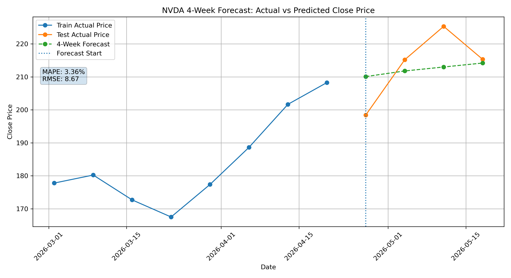

# Agentic Stock Forecasting Pipeline

A lightweight agentic time-series forecasting prototype inspired by the paper **“Nexus: An Agentic Framework for Time Series Forecasting”**.

This project combines real weekly stock prices, financial news headlines, LLM-based reasoning, and backtesting evaluation to generate an interpretable 4-week stock forecast.

> This is a portfolio/demo project for learning and engineering demonstration purposes only. It is not financial advice.

---

## Project Motivation

Traditional time-series forecasting often relies mainly on historical numerical values. However, real-world stock prices are also influenced by external textual events such as company news, earnings expectations, AI sector sentiment, macroeconomic risk, and market momentum.

Inspired by the Nexus framework, this project explores a simplified multimodal forecasting pipeline:


$$
F(X_{1:\tau}, E_{1:\tau}) \rightarrow (\hat{X}_{\tau+1:\tau+T}, R)
$$

Where:

- $X_{1:\tau}$ = historical stock prices
- $E_{1:\tau}$ = financial news/context headlines
- $\hat{X}_{\tau+1:\tau+T}$  = predicted future stock prices
- $R$  = natural language reasoning behind the forecast

---

## Forecast Result

The model used **NVDA weekly close prices** and **Finnhub financial news headlines** from:

```text
2026-03-02 to 2026-04-20
```

as historical context, then generated a **4-week forecast** for:

```text
2026-04-27 to 2026-05-18
```



### Evaluation Result

| Metric | Value |
|---|------:|
| MAPE | 3.36% |
| RMSE |  8.67 |

In this short demo backtesting window, the model produced a conservative upward forecast. It broadly followed the market direction but underestimated part of the short-term price spike during the test period.

---

## Pipeline Overview

```text
1. fetch_real_data.py
    ↓
Collect real weekly stock prices using yfinance
Collect financial news headlines using Finnhub API

2. data_loader.py
    ↓
Load CSV data
Validate required columns
Split train/test data

3. context_agent.py
    ↓
Build structured historical context
Combine price data + news summaries

4. forecast_agent.py
    ↓
Use OpenAI API to generate:
- macro reasoning
- micro week-by-week reasoning
- final 4-week forecast

5. evaluation.py
    ↓
Compare forecast against actual test prices
Calculate MAPE and RMSE
Save evaluation outputs

6. plot_forecast.py
    ↓
Generate Actual vs Predicted forecast visualization

7. main.py
    ↓
Run the full pipeline
```

---

## How This Project Follows the Nexus Paper

This project is inspired by the Nexus idea of combining historical numerical data with external textual context for interpretable forecasting.

| Nexus Paper Component                      | This Project Implementation |
|--------------------------------------------|---|
| Historical numerical sequence $X_{1:\tau}$ | Weekly NVDA close prices from yfinance |
| Textual context $E_{1:\tau}$               | Finnhub financial news headlines |
| Historical Context Agent                   | `context_agent.py` builds structured historical context |
| Macro Reasoning                            | LLM explains the overall stock trend |
| Micro Reasoning                            | LLM explains week-by-week expected movements |
| Forecast Synthesis                         | `forecast_agent.py` outputs final forecast values |
| Evaluation                                 | `evaluation.py` calculates MAPE and RMSE |

This project is a **simplified prototype**, not a full reproduction of the Nexus paper.  
The full Nexus framework includes separate macro, micro, synthesizer, and calibration agents. In this demo, macro reasoning, micro reasoning, and forecast synthesis are implemented inside a lightweight LLM forecasting agent.

---

## Project Structure

```text
agentic-stock-forecasting/
│
├── data/
│   └── real_stock_data.csv
│
├── outputs/
│   ├── forecast_output.json
│   ├── reasoning_output.json
│   ├── forecast_results.csv
│   ├── evaluation_summary.md
│   └── forecast_plot.png
│
├── fetch_real_data.py
├── data_loader.py
├── context_agent.py
├── forecast_agent.py
├── evaluation.py
├── plot_forecast.py
├── main.py
├── requirements.txt
├── .env.example
└── README.md
```

---

## Sample Forecast Output

```json
{
  "macro_reasoning": "NVDA shows a clear medium-term uptrend overall, rising from 177.81 to 208.27, but the path has included a sharp mid-period drawdown before a strong recovery. The latest weeks suggest momentum remains positive, supported by ongoing AI-chip demand and favorable industry headlines, though the stock is already near its recent high so further gains are likely to be more gradual.",
  "micro_reasoning": [
    {
      "week": 1,
      "movement": "up",
      "reason": "The stock ended at a new high and the broader AI-chip narrative remains supportive, so a small follow-through move is reasonable. However, gains should be limited because the recent run-up has been strong.",
      "forecast": 210.1
    },
    {
      "week": 2,
      "movement": "up",
      "reason": "Momentum can persist if investors keep rewarding NVDA's leadership in AI infrastructure, but the pace should moderate as the stock digests prior gains.",
      "forecast": 212.0
    },
    {
      "week": 3,
      "movement": "up",
      "reason": "Continued positive sector sentiment and recurring news flow around AI demand can support another modest increase, though the move is likely smaller than earlier weeks.",
      "forecast": 213.4
    },
    {
      "week": 4,
      "movement": "up",
      "reason": "By week 4, the stock may still edge higher, but upside should be capped by valuation sensitivity and the likelihood of short-term consolidation after the rally.",
      "forecast": 214.6
    }
  ],
  "final_forecast": [
    210.1,
    212.0,
    213.4,
    214.6
  ]
}
```

---

## Tech Stack

- Python
- pandas
- NumPy
- matplotlib
- scikit-learn
- yfinance
- Finnhub API
- OpenAI API
- python-dotenv

---

## How to Run

### 1. Install dependencies

```bash
pip install -r requirements.txt
```

### 2. Create `.env`

Create a `.env` file in the project root:

```env
OPENAI_API_KEY=your_openai_api_key
FINNHUB_API_KEY=your_finnhub_api_key
```

### 3. Fetch real stock and news data

```bash
python fetch_real_data.py
```

This creates:

```text
data/real_stock_data.csv
```

### 4. Run the full forecasting pipeline

```bash
python main.py
```

This creates:

```text
outputs/forecast_output.json
outputs/reasoning_output.json
outputs/forecast_results.csv
outputs/evaluation_summary.md
```

### 5. Generate the forecast plot

```bash
python plot_forecast.py
```

This creates:

```text
outputs/forecast_plot.png
```

---

## Output Files

| File | Description |
|---|---|
| `data/real_stock_data.csv` | Real weekly stock prices and news headlines |
| `outputs/forecast_output.json` | Raw LLM forecast output |
| `outputs/reasoning_output.json` | Saved reasoning output |
| `outputs/forecast_results.csv` | Actual vs predicted close prices |
| `outputs/evaluation_summary.md` | MAPE/RMSE evaluation summary |
| `outputs/forecast_plot.png` | Forecast visualization |

---

## Notes and Limitations

- This is a lightweight prototype, not a production trading model.
- The current demo uses one ticker: NVDA.
- The evaluation uses a short 4-week test window.
- News headlines may contain noise and are filtered using keyword-based logic.
- The model is designed to demonstrate agentic forecasting workflow design, structured LLM output, data collection, and backtesting evaluation.
- This project does not provide investment or financial advice.

---

## Resume Summary

Built a lightweight agentic stock forecasting pipeline using Python, yfinance, Finnhub API, OpenAI API, and MAPE/RMSE backtesting evaluation, integrating real stock price data with financial news context to generate interpretable 4-week forecasts.